<h2 align="center">Hey, I'm Sam</h2>

Infrastructure • Security • Platform Engineering • Systems Automation

---

### About

I design and build secure, automated platforms across cloud, on-prem, and edge environments.  
Strong background in large-scale infrastructure, virtualization, and security automation.

Core focus areas:

- Linux, Kubernetes, and hypervisor platforms  
- Observability, agents, and telemetry systems  
- Security automation and compliance tooling  
- Distributed systems and high-reliability backends  

---

### Featured Projects

- **[Atomic](https://github.com/samwozencroft/atomic)**: A lightweight, native desktop code editor built with Electron and Monaco. Features integrated workspace management.

---

### Certifications & Platforms

- **Nutanix Certified Professional**
- **AWS** (Certified)
- **Google Cloud Platform (GCP)** (Certified)
- **IBM Technologies** (Certified)
- **Proxmox VE** (Advanced / Production deployments)

---

### GitHub Activity

  

  

---

### Primary Technologies

  
  
  
  
  
  
  
  
  
  
  

---

### Current Work

- Platform automation and infrastructure-as-code
- Secure Kubernetes and virtualization environments
- Hybrid and multi-cloud architecture (AWS, GCP, IBM)
- Hyperconverged infrastructure and clustering (Nutanix, Proxmox, VMware, OpenStack)
- UAV ground systems, telemetry, and embedded Linux subsystems

---

### Contact

- 📧 Email: **samuelwozencroft@outlook.com**  
- 📷 Instagram: <https://instagram.com/woz.s_>
